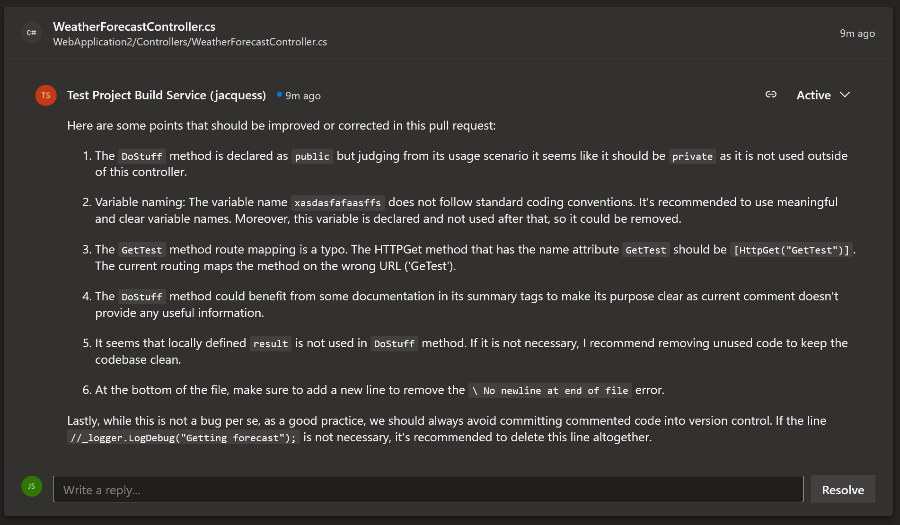

# Use OpenAI GPT model to review Pull Requests for Azure Devops
A task for Azure DevOps build pipelines to add GPT as PR reviewer

## Installation

Installation can be done using [Visual Studio MarketPlace](https://marketplace.visualstudio.com/items?itemName=97Saundersj.AIPullRequestReview).

## Usage

Add the tasks to your build definition.

For each changed file in the Pull Request a review comment will be left if there any recommended changes


## Setup

### Give permission to the build service agent

before use this task, make sure that the build service has permissions to contribute to pull requests in your repository :


### Allow Task to access the system token

#### Yaml pipelines 

Add a checkout section with persistCredentials set to true.

```yaml
steps:
- checkout: self
  persistCredentials: true
```

#### Classic editors 

Enable the option "Allow scripts to access the OAuth token" in the "Agent job" properties :


### Azure Open AI service

If you choose to use the Azure Open AI service, you must fill in the endpoint and API key of Azure OpenAI. The format of the endpoint is as follows: https://{XXXXXXXX}.openai.azure.com/openai/deployments/{MODEL_NAME}/chat/completions?api-version={API_VERSION}


### OpenAI Models

In case you don't use Azure Open AI Service, you can choose which model to use, the supported models are "gpt-4", "gpt-3.5-turbo" and "gpt-3.5-turbo-16k". if no model is selected the "gpt-3.5-turbo" is used.

## Contributions

Found and fixed a bug or improved on something? Contributions are welcome! Please target your pull request against the `main` branch or report an issue on [GitHub](https://github.com/97saundersj/azure-pipeline-ai-pr-review/issues) so someone else can try and implement or fix it.

## License

[MIT](https://raw.githubusercontent.com/97saundersj/azure-pipeline-ai-pr-review/main/LICENSE)
